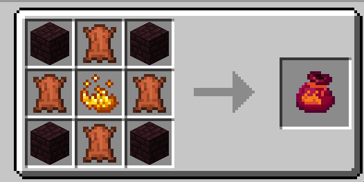

## Nether Bags

Bags for [nether chest](https://modrinth.com/mod/nether-chest)

Craft it by surrounding a blaze powder with 4 leather and 4 nether bricks

(recipe rendered by EMI)

You can then bind this bag to a nether chest by sneak right-clicking on it.
You have to do this or else the bag won't open (no getting cheap nether bags!)

Only works with v5.0 on 1.20.1 maybe I will bother to do more 1.20 versions LATER:tm:

Needs krysztal's language scala3.1.0+scala.3.6.2

It's configurable as well, it matches Nether Chest configs, but you can also configure whether
an unbound bag can be opened to the default channel (default false, it kind of ruins balance).
I'm not your mom or anything, but I suggest that if you do this you make the recipe more expensive
(maybe by requiring a nether star like the original)

You can also config the behavior of the bag - you can make it match the normal nether chest,
and disable the binding feature (otherwise you'd be able to duplicate items).
(default false, again really ruins balance). Again probably change the recipe.
